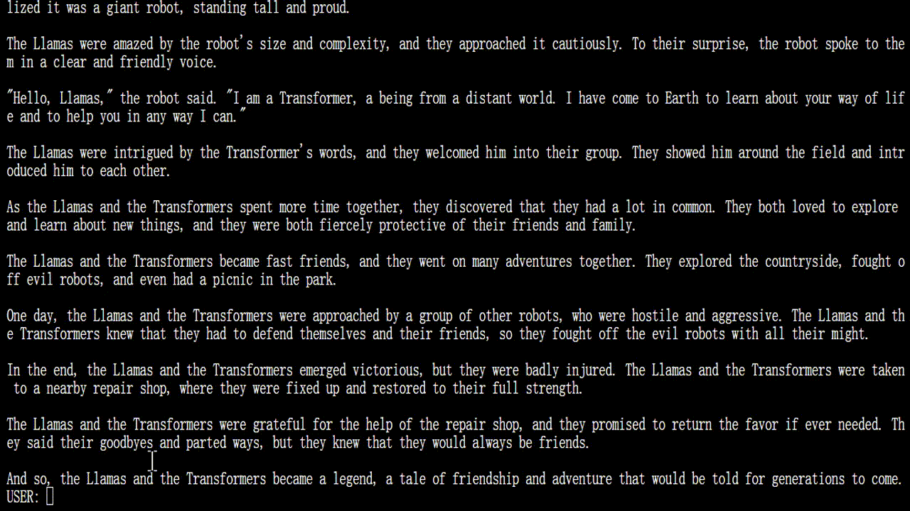
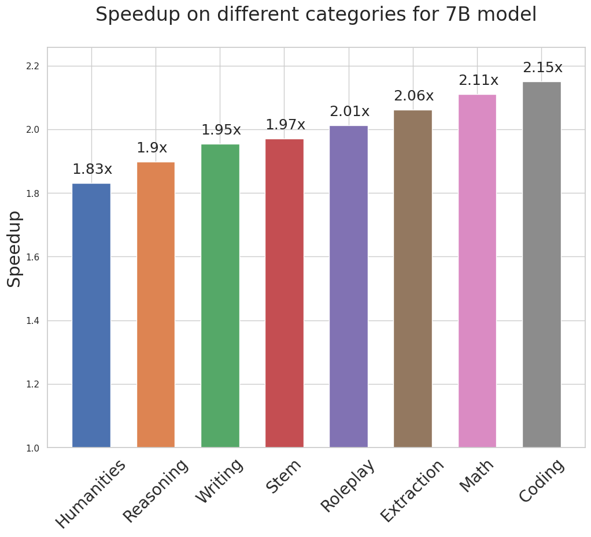
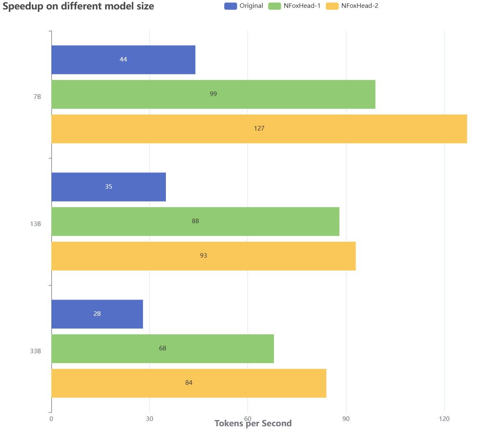

<div align="center"><h1>&nbsp;NFoxHead: Simple Framework for Accelerating LLM Generation</h1></div>

<!-- <p align="center">
| <a href="https://sites.google.com/view/
medusa-llm"><b>Blog</b></a> | <a href="https://arxiv.org/abs/2401.10774"><b>Report</b></a> | <a href="ROADMAP.md"><b>Roadmap</b></a> |
</p> -->

---
*News* 🔥
- [2024/8] 采用one-model的并行解码框架，采用多解码头，从而克服传统自回归式解码瓶颈。最新结果显示，在一系列LLM上，使用NFoxHead速度比原始模型提高2.2-3.6倍，充分利用现代加速器的算术计算潜力！

---
## 简介

NFoxHead 是一个简单的框架，旨在让大型语言模型（LLM）生成的加速技术更加普及，通过多个解码头来实现这一目标。


<div align="center">
  <picture>
  
  </picture>
  <br>
  <div align="center" width="80%">
  <em>NFoxHead on Vicuna-7b.</em>
  </div>
  <br>
</div>


我们致力于解决当前流行的加速技术（如推测性解码）中的三大痛点：

- 对优质初稿模型的高要求。
- 系统的复杂性。
- 在使用基于采样的生成方法时的低效性。

通过 NFoxHead，我们希望简化这些技术的使用，使得在各类应用场景中，大型语言模型的生成速度能够得到显著提升，同时降低实现难度。


<div align="center">
  <picture>
  
  </picture>
  <br>
  <div align="left" width="80%">
  <em>NFoxHead 为 LLM 增加了额外的 “头”，以便同时预测多个未来标记。在使用 NFoxHead 增强模型时，原始模型保持不变，在训练过程中只对新的 “头 ”进行微调。在生成过程中，这些词头会为相应位置生成多个可能的词。然后，使用基于树的注意力机制对这些选项进行组合和处理。最后，采用典型的接受方案，从候选词中挑选出最长的可信前缀进行进一步解码。</em>
  </div>
  <br>
</div>

我们致力于通过以下几个想法来解决推测性解码中遇到的挑战：

- 我们没有引入新的模型，而是基于**同一个模型**训练多个解码头。
- 训练过程采用了参数高效的方法，即使是“GPU资源有限”的用户也能轻松进行训练。而且，由于不需要额外的模型，因此也无需调整分布式计算设置。
- 通过放宽对匹配原模型分布的要求，使得非贪婪生成的速度甚至超过了贪婪解码。

在最初的发布中，我们的主要目标是将 NFoxHead 优化用于批量大小为 1 的场景，这是一种常用于本地模型托管的设置。在这种配置下，NFoxHead 能够在一系列 Vicuna 模型上实现大约 2 倍的速度提升。我们正积极致力于将 NFoxHead 集成到更多的推理框架中，以期实现更高的性能提升，并将 NFoxHead 扩展到更广泛的应用环境中。


<div style="display: flex; justify-content: center; align-items: center; width: 100%; max-width: 1000px; margin: 0 auto;">
  <div style="margin: 0 45px;">
    
  </div>
  <div style="margin: 0 5px;">
    
  </div>
</div>


在更新版本中，我们增加了对全模型训练的支持，称为 NFoxHead-2（相比 NFoxHead-1，后者只训练新的头部），这需要一个特殊的方案，在保持原始模型性能的同时增加投机预测能力。

我们还增加了对自我蒸馏的支持，这使我们能够将 NFoxHead 添加到任何经过微调的 LLM 中，而无需提供原始训练数据。

## 目录
- [简介](#简介)
- [目录](#目录)
- [安装](#安装)
  - [方法一：使用 pip](#方法一使用-pip)
  - [方法二：从源Clone（推荐）](#方法二从源clone推荐)
  - [模型权重](#模型权重)
    - [NFoxHead-1](#nfoxhead-1)
    - [NFoxHead-2](#nfoxhead-2)
  - [推理](#推理)
  - [训练](#训练)
  - [在不同架构上训练](#在不同架构上训练)
    - [准备数据](#准备数据)
    - [将数据适配到你希望启用 NFoxHead 的模型上](#将数据适配到你希望启用-nfoxhead-的模型上)
    - [训练模型](#训练模型)
- [代码库指南](#代码库指南)
- [贡献](#贡献)
- [致谢](#致谢)

## 安装
### 方法一：使用 pip
```bash
pip install NFoxHead-llm
```
### 方法二：从源Clone（推荐）
```bash
git clone https://github.com/FasterDecoding/NFoxHead.git
cd NFoxHead
pip install -e .
```

### 模型权重
#### NFoxHead-1
| Size | Chat Command                                  | Hugging Face Repo                                                     |
| ---- | --------------------------------------------- | --------------------------------------------------------------------- |
| 7B   | `python -m NFoxHead.inference.cli --model lmsys/vicuna-7b-v1.3` | [lmsys/vicuna-7b-v1.3](https://huggingface.co/lmsys/vicuna-7b-v1.3)   |
| 13B  | `python -m NFoxHead.inference.cli --model lmsys/vicuna-13b-v1.3` | [lmsys/vicuna-13b-v1.3](https://huggingface.co/lmsys/vicuna-13b-v1.3) |
| 33B  | `python -m NFoxHead.inference.cli --model lmsys/vicuna-33b-v1.3` | [lmsys/vicuna-33b-v1.3](https://huggingface.co/lmsys/vicuna-33b-v1.3) |

#### NFoxHead-2
| Size | Chat Command                                  | Hugging Face Repo                                                     |
| ---- | --------------------------------------------- | --------------------------------------------------------------------- |
| Llama-3.1-8B   | `python -m NFoxHead.inference.cli --model meta-llama/Meta-Llama-3-8B` | [meta-llama/Meta-Llama-3-8B](https://huggingface.co/meta-llama/Meta-Llama-3-8B)   |
|Llama-3-70B-Instruct | `python -m NFoxHead.inference.cli --model meta-llama/Meta-Llama-3-70B-Instruct` | [meta-llama/Meta-Llama-3-70B-Instruct](https://huggingface.co/meta-llama/Meta-Llama-3-70B-Instruct) |
| Vicuna-33B-v1.3  | `python -m NFoxHead.inference.cli --model lmsys/vicuna-33b-v1.3` | [lmsys/vicuna-33b-v1.3](https://huggingface.co/lmsys/vicuna-33b-v1.3) |


### 推理
我们目前支持批量大小为 1 的单 GPU 推断，这是最常见的本地模型托管设置。我们正在积极扩展 NFoxHead 的功能，将其集成到其他推理框架中；如果您有兴趣参与这项工作，请随时联系我们。

您可以使用以下命令启动 CLI 界面：
```bash
CUDA_VISIBLE_DEVICES=0 python -m NFoxHead.inference.cli --model [path of NFoxHead model]
```
你也可以通过传递 `--load-in-8bit` 或 `--load-in-4bit` 参数，以量化格式加载基础模型。如果你在其他地方下载了基础模型，可以使用 `--base-model [基础模型的路径]` 来覆盖基础模型的名称或路径。


### 训练
在更新的版本中，我们使用了出色的 [axolotl](https://github.com/OpenAccess-AI-Collective/axolotl) 库来管理训练过程。主要的代码修改位于 [`src/axolotl/utils/models.py`](https://github.com/ctlllll/axolotl/blob/main/src/axolotl/utils/models.py)。训练配置可以在 `examples/NFoxHead`中找到。一个典型的训练命令如下：

```bash
accelerate launch -m axolotl.cli.train examples/NFoxHead/your_config.yml
```

自蒸馏的数据准备代码可在当前 repo 的 [`数据生成`文件夹](data_generation) 中找到。对于其他数据集，您可以直接从相应的huggingface repo 中下载数据。

### 在不同架构上训练
*以下说明适用于 NFoxHead 的初始版本，提供了一个训练 NFoxHead-1 模型的最小示例。有关更新版本的内容，请参阅上一节。*

在进行训练之前，请安装以下内容：

```bash
pip install -e ".[train]"
```
#### 准备数据
我们使用了一个公开版本的 ShareGPT 数据集，这是 Vicuna 训练数据的一个子集。对于其他模型，你可以使用相应的训练数据集。

```bash
git clone https://huggingface.co/datasets/Aeala/ShareGPT_Vicuna_unfiltered
```
注意：如果你还没有安装 `git-lfs`，请在克隆之前先安装它：

```bash
git lfs install
```

#### 将数据适配到你希望启用 NFoxHead 的模型上

首先启动一个你喜欢的推理服务器，该服务器将运行你要训练的模型。我们以 [mistralai/Mistral-7B-Instruct-v0.2](https://huggingface.co/mistralai/Mistral-7B-Instruct-v0.2) 为例。

你可以使用 [text-generation-inference](https://github.com/huggingface/text-generation-inference)，在训练完 NFoxHead 解码头后，你也可以继续使用它。


```
model=mistralai/Mistral-7B-Instruct-v0.2
volume=$PWD/data # share a volume with the Docker container to avoid downloading weights every run
docker run --gpus all --shm-size 1g -p 8080:80 -v $volume:/data ghcr.io/huggingface/text-generation-inference:latest --model-id $model --input-length 4000 --max-total-tokens 4096 --max-batch-prefill-tokens 4000
```
ShareGPT 数据集中的一些序列相对较长，因此请确保你能够对这些序列进行推理。如果内存不足，脚本将自动忽略这些较长的对话。这不应该对下游性能产生太大影响，但更多的数据通常会带来更好的效果。

你可以使用各种方法来[加速推理](https://huggingface.co/docs/text-generation-inference/index)，但默认设置在大多数情况下应该已经足够了。


```
python create_data.py --input-filename ShareGPT_Vicuna_unfiltered/ShareGPT_V4.3_unfiltered_cleaned_split.json --output-filename mistral.json
```

#### 训练模型
我们遵循 [FastChat](https://github.com/lm-sys/FastChat#fine-tuning) 的训练设置，但使用了更大的学习率，因为我们冻结了原始模型，只训练新的解码头。以下是针对 Vicuna-7b 模型在 4 个 GPU 上的训练命令。由于我们只训练新的解码头，因此训练不需要大量内存，只需数据并行即可。你可以根据自己的配置修改脚本。对于更大的模型，我们使用相同的设置。你也可以使用 `--load_in_8bit` 或 `--load_in_4bit` 参数以量化格式加载基础模型。

```bash
torchrun --nproc_per_node=4 NFoxHead/train/train_legacy.py --model_name_or_path mistralai/Mistral-7B-Instruct-v0.2 \
    --data_path mistral.json \
    --bf16 True \
    --output_dir test \
    --num_train_epochs 2 \
    --per_device_train_batch_size 8 \
    --per_device_eval_batch_size 8 \
    --gradient_accumulation_steps 4 \
    --evaluation_strategy "no" \
    --save_strategy "no" \
    --learning_rate 1e-3 \
    --weight_decay 0.0 \
    --warmup_ratio 0.1 \
    --lr_scheduler_type "cosine" \
    --logging_steps 1 \
    --tf32 True \
    --model_max_length 2048 \
    --lazy_preprocess True \
    --medusa_num_heads 3 \
    --medusa_num_layers 1 \
    --deepspeed deepspeed.json
```


## 代码库指南
`NFoxHead/model/NFoxHead_model.py` 是 NFoxHead 的核心文件。它包含了 `NFoxHeadModel` 类，这是对原始模型和新增解码头的封装。该类还实现了一个流式生成方法。如果你想深入了解 NFoxHead 的细节，这是一个很好的起点。


## 贡献
如果你有任何改进的想法，请先通过打开一个 Issue 与我们讨论。在提交 Pull Request 时，请确保你的更改经过充分测试。对于每一个重大更改，请将其分成单独的 Pull Request。如果你对项目感兴趣，欢迎随时联系我们进行贡献。

## 致谢
此代码库受到了 LLM 社区中许多优秀项目的影响，包括
[FastChat](https://github.com/lm-sys/FastChat), [TinyChat](https://github.com/mit-han-lab/llm-awq/tree/main/), [vllm](https://github.com/vllm-project/vllm), [axolotl](https://github.com/OpenAccess-AI-Collective/axolotl).
